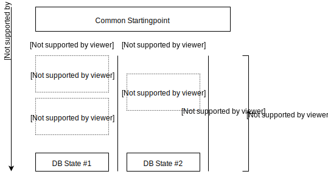

The same issues, which arrise for indepentent dev and live environment are also true if you're working on a team. But not only do you need to reliably move changes from one environment to another, but actually you need to share changes both ways.

Considering the scenario of the diagram and its two coworkers, which both made changes to the db structure. Now Jeff want to share his results with Christine. Not very hard if both sit next to each other and Jeff can shortly explain to Christine what needs to change. But what if it's holiday season and they'll not see each other because of overlapping vacations or one of them is a remote or freelance worker and a bit hard to reach in person.

Migrations give each coworker a loose framework to apply those changes via coded files, so they can easily be shared to other coworkers by any VCS or other file sharing methods. Nothing will be lost in the communication and everyone can come back a few weeks later and still understand what happended in that specific change. Again applying those patches to the db is no longer a manual task as well. Therefore once a migration is created each coworker can apply them in seconds* to their own installation and spend more time testing for possible incompatibilities.

Those migration files also remove the necessity inform coworkers about db changes. It's still a nice thing to do so, but (at least when using git) they'll also see the new migration file(s) in the changelog when merging new features into their own codebase. If they to so they can simply use the CLI tool of the module to run those new migrations and be good to move forward.

*\* There might be longer running migrations, but it's probably not the norm.*

## Different DB states

With that approach coworkers each work of of their own database with their own dummydata, but the same underlying template, field & base-pages setup - because that is all build up only by the migrations on top of a common starting point. I think it's actually a good thing to not share the db, so everyone can work independently and additionally changes might actually be tested in more different situations that way. 

Just to illustrate that with a small example. Somebody in the team implements a blog and when doing so also adds some dummy posts to his installation. A coworker might not have these posts, runs the migrations and takes a look at the blog out of curiosity. He might notice that the case of an empty blog is not taken care of and possibly even finding some error.