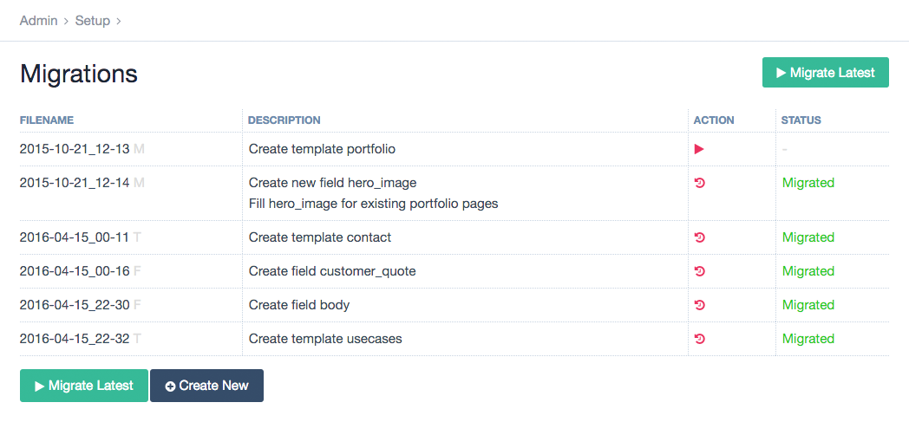

<pre style="font-family: 'Source Code Pro'; color: #00AAFF; background-color: white; margin-top: -2.6em">
    ___       ___       ___       ___       ___       ___       ___
   /\__\     /\  \     /\  \     /\  \     /\  \     /\  \     /\  \
  /::L_L_   _\:\  \   /::\  \   /::\  \   /::\  \    \:\  \   /::\  \
 /:/L:\__\ /\/::\__\ /:/\:\__\ /::\:\__\ /::\:\__\   /::\__\ /::\:\__\
 \/_/:/  / \::/\/__/ \:\:\/__/ \;:::/  / \/\::/  /  /:/\/__/ \:\:\/  /
   /:/  /   \:\__\    \::/  /   |:\/__/    /:/  /   \/__/     \:\/  /
   \/__/     \/__/     \/__/     \|__|     \/__/               \/__/
</pre>

# Intro [](https://travis-ci.org/LostKobrakai/Migrations)

Migrations is a module to manage migration files, which in themselves allow you to handle all the development steps, which affect the ProcessWire database, across multiple enviroments. Be it a simple local development and online live environment by a single developer or multiple developers working in a team with multiple server environments to go through before shipping.

Migration files are simple small class files, which utilize the [ProcessWire API](https://processwire.com/api/ref/) to run any database affecting changes. It's not as nice as using the Admin UI directly, but certainly better than trying to migrate changes manually &ndash; possibly weeks after adding the changes. 

They are NOT database migrations like you might know them from frameworks like Laravel or Ruby on Rails. Those files won't setup any database tables or change table column types. It's about recreating what normally would be done via the backend UI. Creating a field, removing a field from a template, installing a module and so on.



## Migration Types

There are currently four types of migrations shipped with the module:

### __default (Migration)__  
Default migrations are the most free form migrations. There's just a description and two functions – `update()` and `downgrade()`. What you're doing in those functions is totally up to you, but it's recommended to try the best to keep changes as reversible as possible. Meaning that running update() and downgrade() once should have as less effect on the installation as possible. The ProcessWire API is available exactly like in modules using the `$this->pages`, `$this->config`, … syntax.

### __Create/Delete Migrations__

- __FieldMigration__
- __TemplateMigration__
- __ModuleMigration__  
- __AccessMigration (>0.3.1)__  

These make your live easier by providing a more declarative way of migrating the creation of Fields/Templates or the installation of modules. All the boilerplate is handled by the base classes these migrations do extend, so you don't need to think about `update()` and `downgrade()`. You can rather just describe the item you want to be handled and the rest is been taken care of.

## CLI

!!! note "Install the module with composer to use the CLI"
		It will also install all the dependencies and symlink the script to the composer bin-dir. TL;DR it'll make things easier.

The module does include a CLI interface, which does allow migrations to be run automatically by Continous Integration Systems or deployment scripts or just by yourself if you like the command-line. I suggest adding 'vendor/bin' to your $PATH variable. Then you can simply call the CLI script by `migrate -h` from your project root folder. Otherwise you'll need to call it like that: `./vendor/migrate -h`.

<pre>
> migrate -h

[…]

Usage: migrate [-h, --help] [-i info, --info info] [-m migrate, --migrate migrate] [-n new, --new new] 
  [-nf newField, --newField newField] [-nm newModule, --newModule newModule] 
  [-nt newTemplate, --newTemplate newTemplate] [-r rollback, --rollback rollback]

Optional Arguments:
	-m migrate, --migrate migrate
		Run a specific migration or all new* ones if none given.
		* From latest migrated to newest.
	-r rollback, --rollback rollback
		Undo a specific migration or the latest one if none given.
	-n new, --new new
		Bootstrap a new migrations file. Optionally you can already supply a description.
	-nt newTemplate, --newTemplate newTemplate
		Bootstrap a new template migrations file. Optionally you can already supply a description.
	-nm newModule, --newModule newModule
		Bootstrap a new module migrations file. Optionally you can already supply a description.
	-nf newField, --newField newField
		Bootstrap a new field migrations file. Optionally you can already supply a description.
	-i info, --info info
		Get detailed info about a migration.
	-h, --help
		Show all commands of the cli tool.
</pre>

## Helper Functions

There are already a handful of helper function included in the Migration base class, which tackle things I found to need way to much boilerplate for kinda simple changes. Read the code comments on what each of them does.

!!! note "The number of helper functions will probably grow over time."

```
:::php
<?php

/**
 * This does use @diogo's while loop technique to loop over all pages 
 * without getting memory exhaustion. 
 */
$this->eachPageUncache("template=toBeHidden", function($p){
  $p->setAndSave('status', Page::statusHidden);
}); 
```

```
:::php
<?php

/**
 * $template, $field, $reference = null, $after = true
 * The below function reads like this:
 * In the template … add the field … relative to the field … in the position after/before
 */
$this->insertIntoTemplate('basic-page', 'images', 'body', false); 
```

```
:::php
<?php

/**
 * Edit field settings in context of a template
 */
$this->editInTemplateContext('basic-page', 'title', function($f, $template){
  $f->label = 'Headline';
}); 
```

### Custom Helper Functions

You can create your own helper functions by using ProcessWire [Hooks](https://processwire.com/api/hooks/). These functions can then be used in your migrations.

```
:::php
<?php

// in ready.php
$wire->addHook('Migration::renameHome', function(HookEvent $event){
	$name = $event->arguments(0);
	$event->wire('pages')->get('/')->setAndSave('title', $name);
});

// in the migration::update method
$this->renameHome('Root'); 
// in the migration::downgrade method
$this->renameHome('Home'); 
```